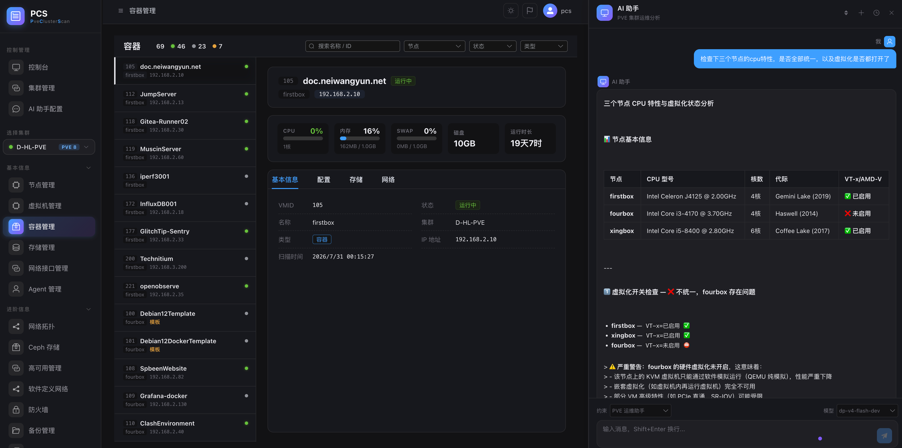
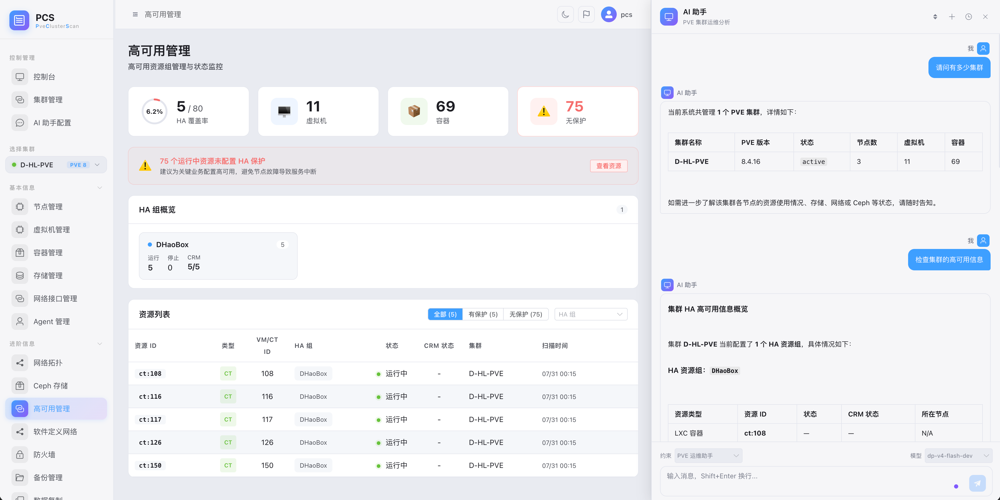

# PVE Cluster Scan

**中文** | [English](README.en.md) | [Deutsch](README.de.md)

PVE 集群扫描与管理平台 — 基于 Django 5 + Vue 3 的全栈解决方案，支持多集群、多 Agent 部署，实时监控 Proxmox VE 环境。

## 功能特性

- **多集群管理**：一个账号管理多个 PVE 集群，统一监控
- **Agent 自动采集**：单文件零依赖 Python Agent，curl 一键安装，自动扫描节点/VM/容器/存储/网络/Ceph/SDN 状态
- **实时仪表盘**：统计卡片、告警列表、资源趋势图（ECharts）、节点状态表格
- **资源管理**：节点、虚拟机（QEMU）、LXC 容器、存储、网络接口、Ceph 存储集群、HA 高可用、SDN 虚拟网络
- **AI 助手（Tool Calling）**：基于 LangChain 的 AI 助手，通过 Tool Calling 自主按需查询集群数据，无需将全部数据塞入 prompt
- **Agent 自动更新**：平台下发更新指令，Agent 自动升级并重启
- **网络拓扑可视化**：SVG 交互式节点-网络连接图
- **依赖链路可视化**：SVG 可拖拽缩放的依赖图（VM/LXC → 节点 → 存储 → 网络）
- **用户认证**：JWT 登录/注册/密码重置，操作日志审计，支持 LDAP 外部认证
- **亮暗主题**：默认暗色，支持一键切换，偏好持久化

## 截图预览

### 暗色主题


### 亮色主题


## 技术栈

| 层 | 技术 |
|----|------|
| 后端 | Python 3.12 + Django 5.0 + DRF + SimpleJWT + django-auth-ldap |
| 前端 | Vue 3 + TypeScript + Vite + Element Plus + Pinia |
| 图表 | ECharts + vue-echarts |
| AI | LangChain + LangChain-OpenAI（LLM 流式 + Tool Calling） |
| Agent | Python stdlib（零依赖） |

## 快速开始

### 一键启动

```bash
# 安装依赖
pip install -r requirements.txt
cd frontend && npm install && cd ..

# 数据库迁移
python manage.py migrate

# 启动（后端 + 前端构建 + uvicorn）
./dev_start.sh
```

### 分别启动

```bash
source .venv/bin/activate
uvicorn config.asgi:application --host 0.0.0.0 --port 8066 --reload
cd frontend && npm run dev   # Vite 开发服务器
```

访问 `http://localhost:8066`。

### Agent 安装

在 PVE 节点上一键安装：

```bash
curl -fsSL 'http://platform:8066/api/agent/install.sh?token=<token>&platform=<url>' | bash
```

或手动安装：

```bash
curl -fsSL 'http://platform:8066/api/agent/install.sh?agent=1' -o agent.py
python3 agent.py install     # 交互式配置 + 注册 + 安装 systemd
```

## Docker 部署

PCS 镜像发布在 GitHub Container Registry (ghcr.io)，支持多架构（amd64/arm64）。

### 快速开始（SQLite）

1. 拉取镜像

```bash
docker pull ghcr.io/vrolist/pcs:latest
```

2. 启动（SQLite 默认，数据存在卷中）

```bash
docker run -d --name pcs \
  -p 8066:8066 \
  -e DB_ENGINE=sqlite \
  -v pcs_data:/app/data \
  -v pcs_media:/app/media \
  ghcr.io/vrolist/pcs:latest
```

3. 访问 `http://<服务器IP>:8066`
   默认管理员：`pcs` / `123456`（首次启动自动创建）

### 使用 docker compose（推荐）

```yaml
services:
  app:
    image: ghcr.io/vrolist/pcs:latest
    container_name: pcs-app
    environment:
      DB_ENGINE: sqlite
      DB_PATH: /app/data/db.sqlite3
    ports:
      - "8066:8066"
    volumes:
      - app_data:/app/data
      - app_media:/app/media

volumes:
  app_data:
  app_media:
```

### 中国大陆加速拉取

由于 ghcr.io 在大陆直连不稳定，可使用国内镜像前缀替代：

**南京大学镜像（推荐）**

```bash
docker pull ghcr.nju.edu.cn/vrolist/pcs:latest
```

**或 DockerProxy 镜像**

```bash
docker pull ghcr.dockerproxy.com/vrolist/pcs:latest
```

使用镜像站拉取后，如需保留原始标签，可重新打标签：

```bash
docker tag ghcr.nju.edu.cn/vrolist/pcs:latest ghcr.io/vrolist/pcs:latest
```

### 更新到最新版本（三数据库通用）

核心命令（一条搞定）：

```bash
docker compose up -d --pull always --force-recreate
```

| 参数 | 作用 |
|:----|:-----|
| `up -d` | 启动服务（后台） |
| `--pull always` | 强制拉取最新镜像（覆盖本地缓存） |
| `--force-recreate` | 强制重建容器（用新镜像替换） |
| 命名卷不动 | 数据保留 ✅ |

三种数据库各自的完整命令：

| 数据库 | 命令 | 数据位置 |
|:-------|:-----|:---------|
| SQLite | `cd /opt/pcs-test && docker compose up -d --pull always --force-recreate` | `app_data` 卷 → `/app/data/db.sqlite3` ✅ |
| MySQL | `cd /opt/pcs-mysql && docker compose up -d --pull always --force-recreate` | `mysql_data` 卷 → MySQL 数据目录 ✅ |
| PostgreSQL | `cd /opt/pcs-postgres && docker compose up -d --pull always --force-recreate` | `pg_data` 卷 → PostgreSQL 数据目录 ✅ |

> ⚠️ **为什么数据不会丢**：`docker compose up -d --pull always --force-recreate` 只动镜像和容器层，**不动命名卷**（`app_data` / `mysql_data` / `pg_data`）。旧容器删除 → 新容器挂载同一个卷 → 数据完整。

| 卷 | 对应数据库 | 数据内容 |
|:---|:---------|:---------|
| `app_data` | SQLite | db.sqlite3 |
| `mysql_data` | MySQL | MySQL 数据文件 |
| `pg_data` | PostgreSQL | PG 数据文件 |

> 🚫 **千万别用（会删数据）**：`docker compose down -v`（`-v` 会删除命名卷 = 数据全没）；`docker volume rm xxx`（手动删卷）。

**一键脚本（三库通用，推荐放项目里）：**

```bash
#!/bin/bash
# update_pcs.sh - 更新 PCS 镜像并重启（数据保留）
set -e

# 进入 compose 目录（支持参数传入或自动检测）
COMPOSE_DIR="${1:-.}"
cd "$COMPOSE_DIR"

echo "=== 更新 PCS 镜像 ==="
docker compose pull          # 拉取最新镜像

echo "=== 重建容器（数据保留）==="
docker compose up -d --force-recreate

echo "=== 验证 ==="
docker compose ps
echo "✅ 更新完成，数据未动"
```

用法：

```bash
./update_pcs.sh /opt/pcs-test      # SQLite
./update_pcs.sh /opt/pcs-mysql     # MySQL
./update_pcs.sh /opt/pcs-postgres  # PostgreSQL
```

**更新后验证：**

```bash
# 1. 新镜像生效
docker compose ps

# 2. 服务健康
curl -s -o /dev/null -w "HTTP %{http_code}\n" http://localhost:8066/

# 3. 数据还在（超级用户 pcs 应该还在）
docker compose exec app python3 manage.py shell -c \
  "from apps.accounts.models import User; print(f'用户数: {User.objects.count()}')"

# 4. 数据库表还在
docker compose exec mysql mysql -uroot -p* -e "USE pveclusterscan; SHOW TABLES;" 2>/dev/null | head -5
```

| 需求 | 满足 |
|:----|:----:|
| 一条命令更新+重启 | ✅ `docker compose up -d --pull always --force-recreate` |
| 支持三数据库 | ✅ 各自 compose 目录执行即可 |
| 数据不丢失 | ✅ 命名卷不动，只换镜像和容器 |
| 首次部署也适用 | ✅ 命令兼容首次启动 |

或手动两步

```bash
docker pull ghcr.io/vrolist/pcs:latest
docker compose up -d
```

> ⚠️ 更新不会丢失数据（SQLite 数据在命名卷中）。不要使用 `docker compose down -v`，它会删除数据卷。

## 项目结构

```
pve-cluster-scan/
├── config/                 # Django 项目配置
│   ├── asgi.py             #   ASGI 入口（uvicorn）
│   └── sse_handler.py      #   SSE 流式处理器（绕过 Django 中间件）
├── apps/
│   ├── accounts/           # 用户认证 & 操作日志 & AI 助手
│   │   ├── llm_service.py  #   LangChain LLM 封装（build_llm / stream_chat / stream_chat_with_tools）
│   │   ├── llm_tools.py    #   Tool Calling：8 个 PVE 数据查询工具
│   │   └── chat_context.py #   PVE 上下文注入（降级方案）
│   ├── clusters/           # 集群管理（CRUD + Agent 列表）
│   ├── agent_api/          # Agent 通信（注册/心跳/扫描上传/任务下发）
│   ├── dashboard/          # 仪表盘查询 API
│   └── scanner/            # 扫描数据 & 自动检测
├── frontend/               # Vue 3 + Vite 前端
│   └── src/views/          # 页面（仪表盘/集群/节点/VM/容器/SDN/设置等）
├── agent/                  # Agent 单文件（零依赖 Python 脚本）
├── data-structure/         # PVE 数据结构分析文档
└── dev_start.sh            # 一键启动脚本
```

## AI 助手（Tool Calling）

AI 助手使用 **LangChain Tool Calling** 按需查询数据，而非静态注入全部数据：

```
用户提问："pve-1 节点 CPU 情况？"
  → LLM 自主决定调用 get_node_status(node_name="pve-1")
  → 工具执行，查询数据库
  → LLM 基于真实数据生成回答
```

**相比静态注入的优势：**
- 按需取数，大幅节省 token（~200 vs 数千）
- LLM 自主决定查询内容，无关数据不再浪费
- 支持多轮追问，Agent 可记住前一轮结果
- LLM 不支持 Tool Calling 时自动降级

**8 个数据工具：**

| 工具 | 说明 |
|------|------|
| `get_cluster_summary` | 集群概览（PVE 版本、节点/VM/容器数） |
| `get_node_status` | 节点 CPU、内存、磁盘、运行时长 |
| `get_vm_list` | 虚拟机列表或指定 VM 详情 |
| `get_container_list` | LXC 容器列表或指定容器详情 |
| `get_storage_list` | 存储容量与使用情况 |
| `get_ceph_status` | Ceph 健康状态、OSD、存储池 |
| `get_network_info` | 网络接口 + SDN 区域/VNet/子网 |
| `get_ha_resources` | HA 高可用资源配置与状态 |

## API 概览

| 模块 | 端点 | 说明 |
|------|------|------|
| 认证 | `/api/auth/` | 登录/注册/密码重置/用户信息/操作日志/LDAP管理 |
| Agent | `/api/agent/` | 注册/心跳/扫描上传/任务/版本/安装脚本 |
| 仪表盘 | `/api/dashboard/` | 统计/告警/趋势/节点状态 |
| 集群 | `/api/clusters/` | 集群 CRUD + Agent 列表 |
| 扫描 | `/api/scanner/` | 节点/VM/容器/存储/网络/Ceph/HA/SDN 查询 |

详细 API 文档见 `data-structure/api-interfaces.md`。

## 测试

```bash
# 运行全部测试（211+ 测试用例）
python manage.py test apps.agent_api apps.clusters apps.dashboard --verbosity=2

# 仅运行 LLM/Tool Calling 测试
python manage.py test apps.accounts.tests_llm --verbosity=1
```

## 支持我们

如果你觉得这个项目有用，欢迎扫描下方二维码支持我们 ❤️

**微信赞赏**


**支付宝赞赏**


**添加微信好友交流**


**关注公众号**

PCS 项目的开发相关信息会在公众号中逐步更新，例如分析功能、AI 能力、PVE 集群数据等。


## 许可证

本项目采用 [GNU Affero General Public License v3.0](LICENSE) 协议。

这意味着你可以自由使用、修改和分发本软件，但如果你通过网络向用户提供服务，则必须公开修改后的完整源码。
