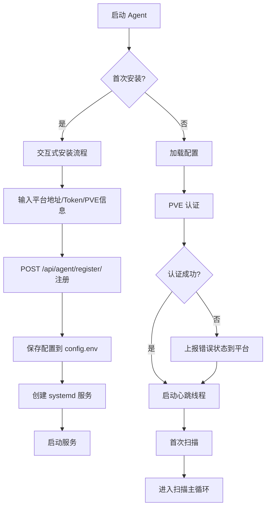
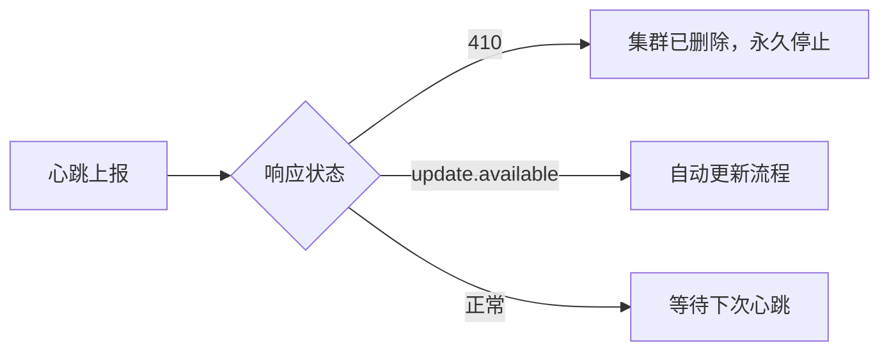
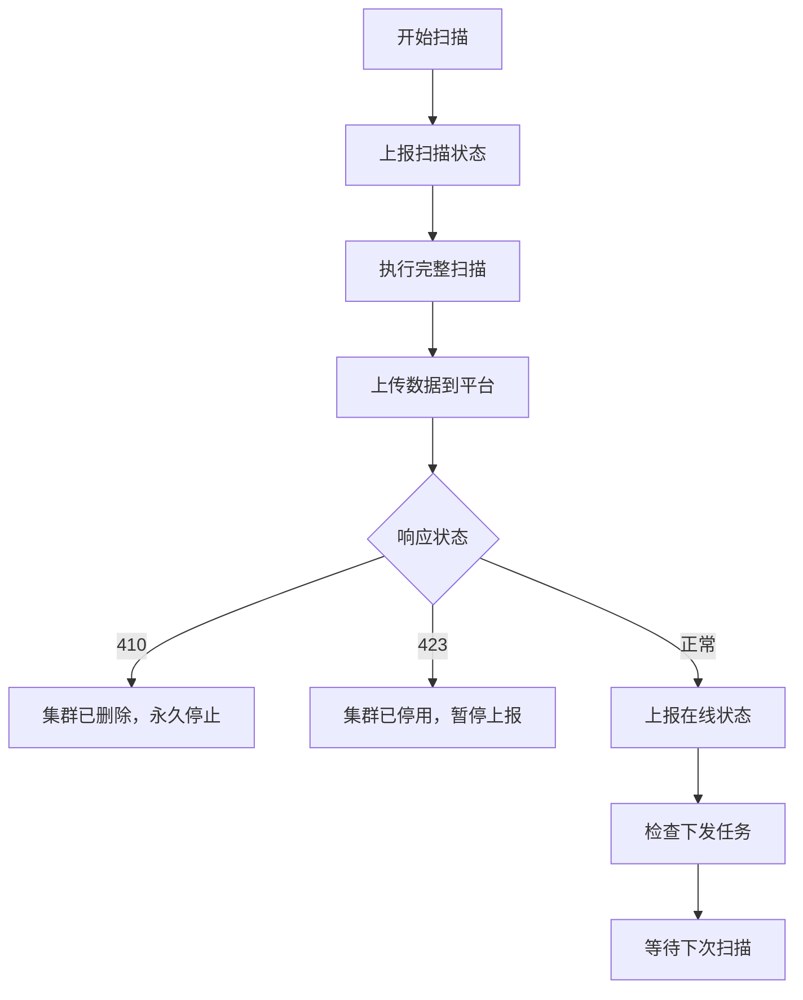
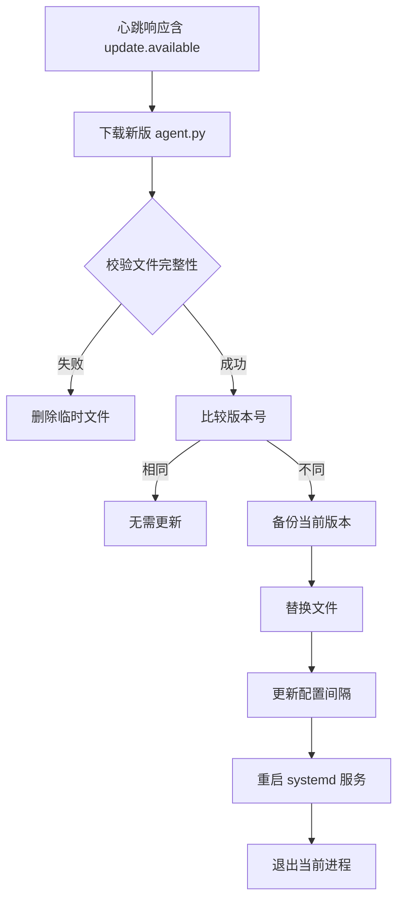

# PVE Cluster Scan Agent (pcs-agent) 完整指南

## 项目概述

pcs-agent 是 PVE 集群扫描与管理平台的数据采集组件，部署在 PVE 节点上，负责定期采集集群状态数据并上报到管理平台。

### 核心特性

- **零依赖**：纯 Python 标准库实现，无需额外安装包
- **单文件部署**：单个 `agent.py` 文件即可运行
- **自动更新**：平台下发更新指令，Agent 自动下载替换并重启
- **状态感知**：自动处理集群删除/停用等状态变化
- **错误恢复**：认证失败/扫描失败不影响整体运行
- **安全配置**：配置文件权限 600，支持 API Token 认证

---

## 架构设计

```
┌─────────────────────────────────────────────────────────────┐
│                    PVE 集群节点                              │
├─────────────────────────────────────────────────────────────┤
│  pcs-agent                                                  │
│  ┌─────────────┐  ┌─────────────┐  ┌─────────────┐         │
│  │ 配置管理     │  │ PVE 客户端   │  │ 平台通信     │         │
│  │ (Config)    │  │ (PVEClient) │  │ (Platform)  │         │
│  └─────────────┘  └─────────────┘  └─────────────┘         │
│         │               │               │                  │
│         ▼               ▼               ▼                  │
│  ┌─────────────────────────────────────────────────────┐   │
│  │                    Agent 主循环                      │   │
│  │  ┌─────────────┐           ┌─────────────┐          │   │
│  │  │ 心跳线程     │           │ 扫描主循环   │          │   │
│  │  │ (120s)      │           │ (300s)      │          │   │
│  │  └─────────────┘           └─────────────┘          │   │
│  └─────────────────────────────────────────────────────┘   │
└─────────────────────────────────────────────────────────────┘
                              │
                              ▼
┌─────────────────────────────────────────────────────────────┐
│                  管理平台 (Django)                           │
│  /api/agent/register/  /api/agent/heartbeat/                │
│  /api/agent/scan/upload/  /api/agent/tasks/                 │
└─────────────────────────────────────────────────────────────┘
```

---

## 安装部署

### 方式一：一键安装（推荐）

```bash
# 从管理平台获取安装命令
curl -fsSL 'http://platform:8066/api/agent/install.sh?token=<agent_token>&platform=<platform_url>' | bash
```

安装过程：
1. 下载 `agent.py` 到 `/opt/pcs-agent/`
2. 交互式输入 PVE 地址/用户名/密码
3. 注册到管理平台
4. 保存配置文件
5. 创建并启动 systemd 服务

### 方式二：手动安装

```bash
# 1. 下载 agent.py
curl -fsSL 'http://platform:8066/api/agent/install.sh?agent=1' -o agent.py

# 2. 交互式安装
sudo python3 agent.py install

# 3. 查看状态
python3 agent.py status
```

### 方式三：直接运行

```bash
# 单次扫描（测试用）
python3 agent.py once

# 前台运行（调试用）
python3 agent.py run
```

---

## 配置说明

### 配置文件位置

```
/opt/pcs-agent/config.env
```

### 配置项说明

| 配置项 | 说明 | 默认值 |
|--------|------|--------|
| `platform_url` | 管理平台地址 | 必填 |
| `agent_token` | Agent 注册令牌 | 必填 |
| `agent_id` | Agent 唯一标识（自动生成） | - |
| `cluster_id` | 关联的集群 ID（自动生成） | - |
| `pve_endpoint` | PVE API 地址 | 必填 |
| `pve_username` | PVE 用户名 | `root@pam` |
| `pve_password` | PVE 密码或 API Token | 必填 |
| `scan_interval` | 扫描间隔（秒） | `300` |
| `heartbeat_interval` | 心跳间隔（秒） | `120` |

### 认证方式

#### 1. 密码认证

```env
pve_username="root@pam"
pve_password="your_password"
```

#### 2. API Token 认证

```env
pve_username="root@pam"
pve_password="PVEAPIToken=user@realm!tokenid=uuid"
```

Token 格式：`user@realm!tokenid=uuid`（包含 `!` 和 `=`）

---

## 工作流程

### 启动流程



### 心跳循环（每 120 秒）



**心跳上报内容：**
```json
{
  "agent_id": "hex-uuid",
  "status": "online|error|paused",
  "current_task": "scanning|deactivated|",
  "version": "0.7.0",
  "error_message": "错误信息（可选）"
}
```

### 扫描循环（每 300 秒）



---

## 数据采集

### 采集范围

| 数据类型 | 采集内容 | API 端点 |
|---------|---------|---------|
| **集群版本** | PVE 版本号 | `/version` |
| **节点状态** | CPU/内存/磁盘/网络/运行时长 | `/nodes/{node}/status` |
| **虚拟机** | 配置/状态/快照/网络/磁盘 | `/nodes/{node}/qemu` |
| **LXC 容器** | 配置/状态/挂载点/网络 | `/nodes/{node}/lxc` |
| **存储** | 容量/使用率/类型/共享状态 | `/nodes/{node}/storage` |
| **网络** | 接口/IP/网关/速度/Bond/VLAN | `/nodes/{node}/network` |
| **Ceph** | 健康状态/OSD/PG | `/cluster/ceph/status` |
| **HA** | 资源组/状态/节点/重启策略 | `/cluster/ha/resources` |
| **SDN** | 区域/虚拟网络/子网 | `/cluster/sdn/zones` |

### 单位转换规则

| 原始数据 | 存储格式 | 转换公式 |
|---------|---------|---------|
| bytes (内存) | MB | `value // 1048576` |
| bytes (磁盘) | GB | `round(value / 1073741824, 2)` |
| CPU (0~1) | 百分比 | `round(value * 100, 1)` |

### 上传数据格式

```json
POST /api/agent/scan/upload/
{
  "agent_id": "hex-uuid",
  "cluster_id": "int",
  "scanned_at": "2026-07-03T10:30:00Z",
  "version": "pve-manager/8.2.4",
  "nodes": [
    {
      "name": "pve-1",
      "status": "online",
      "cpu_load": 35.0,
      "memory_total_mb": 32000,
      "memory_used_mb": 16000,
      "rootfs_total_gb": 100.5,
      "vms": [...],
      "containers": [...],
      "storages": [...],
      "networks": [...]
    }
  ],
  "ceph": {
    "health": "HEALTH_OK",
    "total_osds": 12,
    "up_osds": 12,
    "in_osds": 12
  },
  "ha_resources": [
    {
      "sid": "vm:100",
      "type": "vm",
      "vmid": 100,
      "node": "pve-1",
      "state": "started",
      "ha_group": "group1"
    }
  ],
  "sdn": {
    "zones": [...],
    "vnets": [...],
    "subnets": [...]
  }
}
```

---

## 状态管理

### Agent 状态

| 状态 | 说明 | 触发条件 |
|------|------|---------|
| `online` | 正常运行 | 默认状态 |
| `error` | 错误状态 | PVE 认证失败/扫描失败 |
| `paused` | 暂停状态 | 集群停用（423） |
| `scanning` | 扫描中 | 正在执行扫描任务 |
| `deactivated` | 已停用 | 集群停用 |

### 特殊状态处理

| 场景 | HTTP 状态码 | 处理方式 |
|------|------------|---------|
| 集群删除 | 410 | `systemctl disable pcs-agent` + 退出 |
| 集群停用 | 423 | 暂停上传，心跳保持 |
| PVE 认证失败 | - | 上报错误状态，继续运行 |
| 扫描失败 | - | 上报错误状态，继续运行 |

### 永久停止机制

当收到 410 状态码时，Agent 执行永久停止：

```python
def _stop_permanently(self, reason="集群已删除"):
    logger.warning(f"{reason}，停止 Agent 并禁用自动重启")
    self._running = False
    os.system("systemctl disable pcs-agent 2>/dev/null")
    sys.exit(0)
```

---

## 自动更新机制

### 更新流程



### 更新触发条件

心跳响应中包含 `update.available` 字段：

```json
{
  "ok": true,
  "update": {
    "available": true,
    "latest_version": "0.7.0",
    "download_url": "http://platform:8066/api/agent/install.sh?agent=1",
    "changelog": "v0.7.0: 新增功能..."
  }
}
```

### 更新保护机制

1. **文件校验**：检查下载文件是否包含 `VERSION = "` 字段
2. **版本比较**：下载版本与当前版本相同则跳过
3. **备份保留**：更新前备份为 `agent.py.bak`
4. **配置同步**：更新后同步配置文件中的间隔参数

---

## CLI 命令

### 命令列表

```bash
python3 agent.py install    # 交互式安装
python3 agent.py run        # 运行（心跳+扫描循环）
python3 agent.py once       # 单次扫描
python3 agent.py status     # 查看状态
python3 agent.py uninstall  # 卸载
python3 agent.py version    # 查看版本
```

### 命令详解

#### install - 交互式安装

```bash
sudo python3 agent.py install
```

安装流程：
1. 检查 root 权限
2. 交互式输入配置信息
3. 注册到管理平台
4. 保存配置文件
5. 复制 agent.py 到安装目录
6. 创建 systemd 服务
7. 启动服务

#### run - 运行 Agent

```bash
python3 agent.py run
```

启动心跳线程和扫描主循环，持续运行直到收到停止信号。

#### once - 单次扫描

```bash
python3 agent.py once
```

执行一次完整扫描并上传数据，适用于测试场景。

#### status - 查看状态

```bash
python3 agent.py status
```

显示当前 Agent 状态、配置信息和服务状态。

#### uninstall - 卸载

```bash
sudo python3 agent.py uninstall
```

卸载流程：
1. 通知管理平台
2. 停止并删除 systemd 服务
3. 清理安装目录

---

## 文件结构

### 安装目录

```
/opt/pcs-agent/
├── agent.py          # 主程序
├── config.env        # 配置文件（权限 600）
├── agent.log         # 日志文件
├── agent.py.bak      # 更新备份
└── agent.py.new      # 更新临时文件
```

### systemd 服务

```
/etc/systemd/system/pcs-agent.service
```

服务配置：
```ini
[Unit]
Description=PVE Cluster Scan Agent
After=network.target

[Service]
Type=simple
ExecStart=/usr/bin/python3 /opt/pcs-agent/agent.py run
Restart=always
RestartSec=10
WorkingDirectory=/opt/pcs-agent

[Install]
WantedBy=multi-user.target
```

### 服务管理命令

```bash
systemctl status pcs-agent    # 查看状态
systemctl start pcs-agent     # 启动
systemctl stop pcs-agent      # 停止
systemctl restart pcs-agent   # 重启
systemctl disable pcs-agent   # 禁用自动启动
journalctl -u pcs-agent -f    # 实时日志
```

---

## 故障排查

### 常见问题

#### 1. PVE 认证失败

**症状：** Agent 状态显示 `error`，日志包含 `PVE 认证失败`

**排查步骤：**
```bash
# 检查配置文件
cat /opt/pcs-agent/config.env

# 手动测试 PVE 连接
curl -k -X POST "https://pve-ip:8006/api2/json/access/ticket" \
  -d "username=root@pam&password=your_password"

# 检查 Agent 日志
journalctl -u pcs-agent -n 50
```

**解决方案：**
- 确认 PVE 地址和端口正确
- 确认用户名和密码正确
- 检查网络连通性
- 如果使用 API Token，确认格式正确

#### 2. 注册失败

**症状：** 安装时提示 `注册失败`

**排查步骤：**
```bash
# 检查平台地址是否可达
curl http://platform:8066/api/agent/version/

# 检查 Token 是否有效
curl -X POST http://platform:8066/api/agent/register/ \
  -H "Content-Type: application/json" \
  -d '{"agent_token": "your_token", ...}'
```

**解决方案：**
- 确认平台地址正确
- 确认 Agent Token 有效
- 检查网络连通性

#### 3. 扫描失败

**症状：** 日志包含 `扫描失败`

**排查步骤：**
```bash
# 检查 PVE API 是否可达
curl -k "https://pve-ip:8006/api2/json/version"

# 检查 Agent 日志详情
journalctl -u pcs-agent -n 100 | grep -i error
```

**解决方案：**
- 检查 PVE 节点状态
- 确认 Agent 有足够的 API 访问权限
- 检查网络稳定性

#### 4. 服务无法启动

**症状：** `systemctl start pcs-agent` 失败

**排查步骤：**
```bash
# 检查服务状态
systemctl status pcs-agent

# 检查日志
journalctl -u pcs-agent -n 20

# 检查 Python 路径
which python3

# 手动运行测试
cd /opt/pcs-agent
python3 agent.py once
```

**解决方案：**
- 确认 Python3 已安装
- 确认 agent.py 文件存在且有执行权限
- 检查配置文件是否完整

### 日志分析

#### 日志位置

```bash
# Agent 日志文件
tail -f /opt/pcs-agent/agent.log

# systemd 日志
journalctl -u pcs-agent -f
```

#### 日志级别

| 级别 | 说明 |
|------|------|
| INFO | 正常运行信息 |
| WARNING | 警告信息（如心跳失败） |
| ERROR | 错误信息（如扫描失败） |

#### 关键日志模式

```bash
# 注册成功
grep "注册成功" /opt/pcs-agent/agent.log

# 扫描完成
grep "扫描完成" /opt/pcs-agent/agent.log

# 错误信息
grep -i "error\|失败" /opt/pcs-agent/agent.log

# 更新记录
grep "更新" /opt/pcs-agent/agent.log
```

---

## 性能优化

### 扫描间隔调整

根据集群规模调整扫描间隔：

| 集群规模 | 建议扫描间隔 | 建议心跳间隔 |
|---------|-------------|-------------|
| 小型（1-3 节点） | 300 秒 | 120 秒 |
| 中型（4-10 节点） | 600 秒 | 180 秒 |
| 大型（10+ 节点） | 900 秒 | 300 秒 |

修改配置文件：
```env
scan_interval=600
heartbeat_interval=180
```

### 资源占用

Agent 资源占用极低：
- **CPU**：< 1%（扫描期间短暂升高）
- **内存**：~20MB
- **网络**：每 5 分钟一次小批量数据上传

---

## 安全建议

### 1. 使用 API Token 认证

推荐使用 API Token 替代密码认证：

```bash
# 在 PVE 中创建 API Token
pveum user add agent@pam
pveum aclmod / -user agent@pam -role PVEAuditor
pveum user token add agent@pam mytoken
```

### 2. 限制 API 权限

Agent 只需要只读权限，建议使用 `PVEAuditor` 角色。

### 3. 配置文件权限

配置文件自动设置为 600 权限（仅 owner 可读写）。

### 4. 网络安全

- 使用 HTTPS 连接 PVE API
- 限制 Agent 访问的网络范围
- 定期更新 Agent 版本

---

## 版本历史

### v0.7.0 (当前版本)

- 新增 SDN 虚拟网络数据采集
- 优化自动更新机制
- 改进错误处理和日志输出

### v0.6.0

- 新增 HA 资源采集
- 新增 Ceph 状态采集
- 支持 API Token 认证

### v0.5.0

- 新增自动更新功能
- 优化扫描性能
- 改进状态管理

### v0.4.0

- 新增快照信息采集
- 优化内存使用
- 改进错误恢复机制

---

## 相关文档

- [PVE 集群扫描平台架构](./platform-architecture.md)
- [数据结构与字段映射](./database-models.md)
- [API 接口文档](./api-interfaces.md)
- [Agent 设计文档](./agent-design.md)

---

## 技术支持

### 获取帮助

```bash
# 查看版本
python3 agent.py version

# 查看状态
python3 agent.py status

# 查看帮助
python3 agent.py
```

### 反馈问题

1. 收集日志：`journalctl -u pcs-agent -n 200 > agent.log`
2. 收集配置：`cat /opt/pcs-agent/config.env`（注意脱敏）
3. 描述问题现象和复现步骤

---

**最后更新：** 2026-07-03  
**当前版本：** v0.7.0  
**维护团队：** PVE Cluster Scan Team